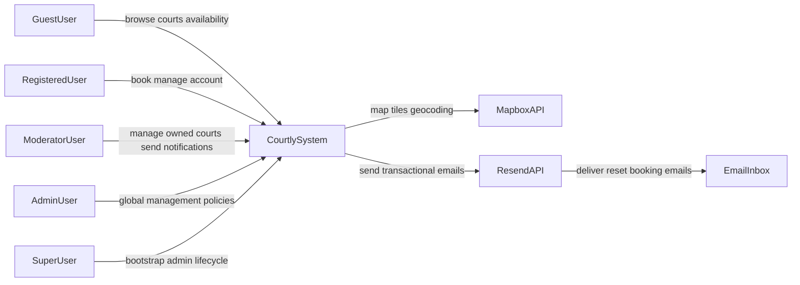
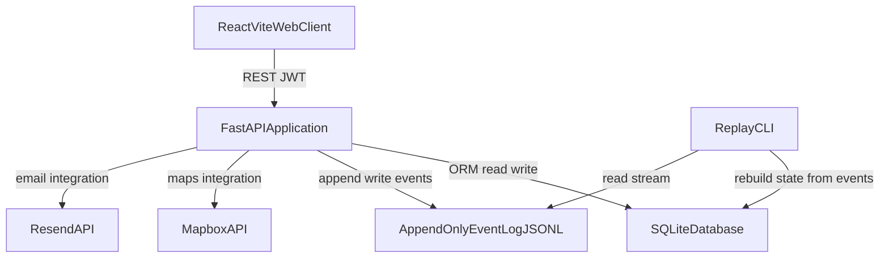
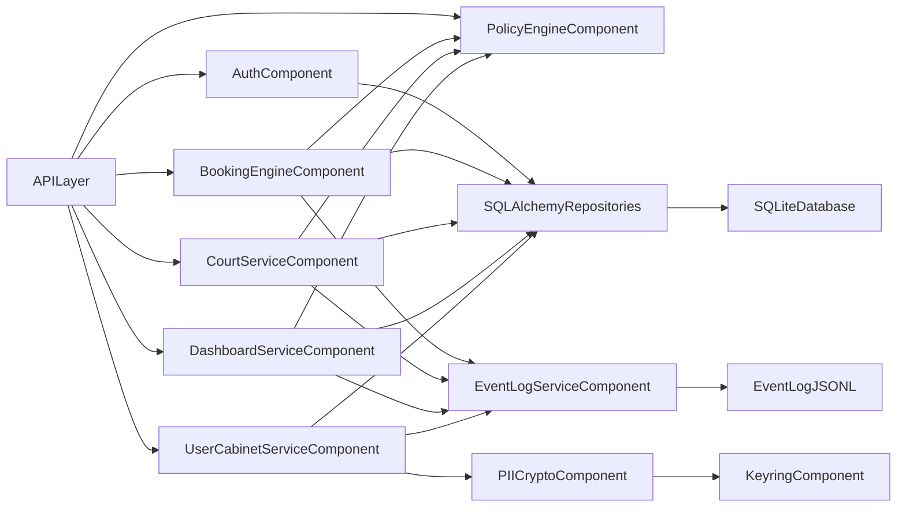
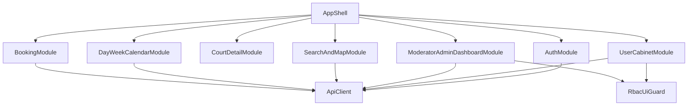
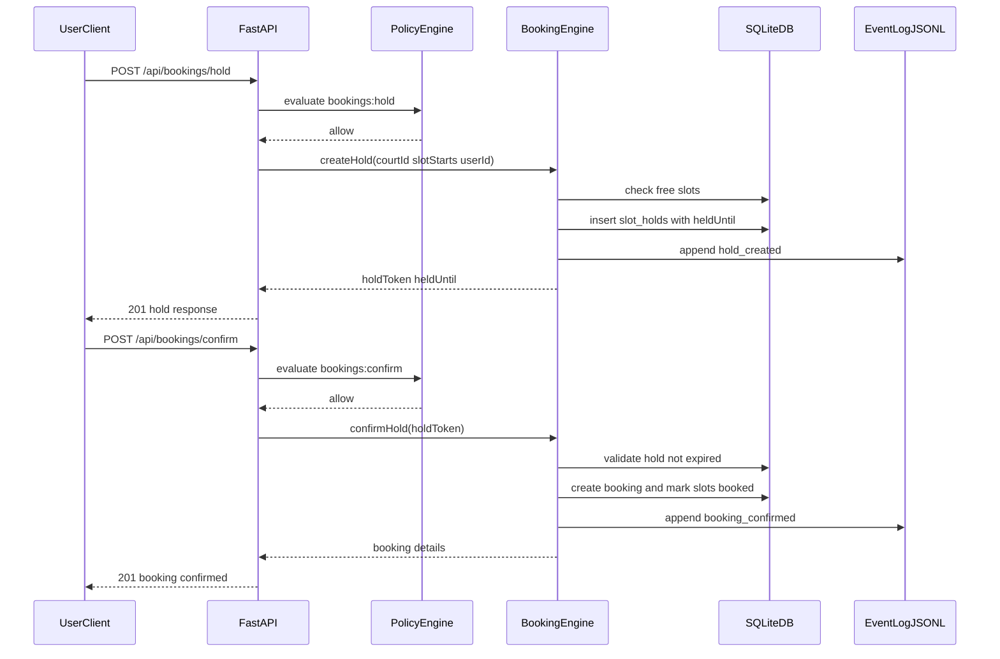
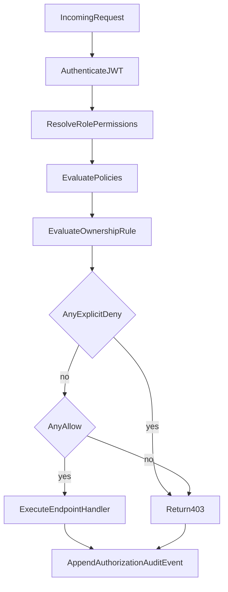
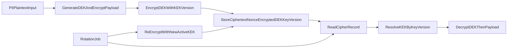
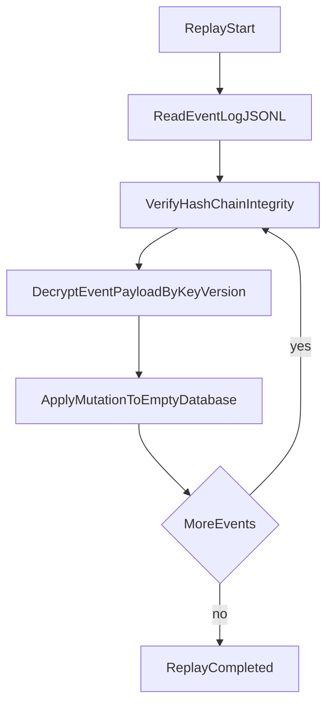

# Courtly Architecture Diagrams

Набір C-level діаграм (C1-C4) для Courtly у форматі Mermaid.

## C1 — System Context

## C2 — Container Diagram

## C3 — Backend Component Diagram

## C3 — Frontend Component Diagram

## C4 — Booking Hold and Confirm Sequence

## C4 — Authorization Decision Flow

## C4 — PII Encryption and Key Rotation

## C4 — Event Log Replay Recovery

